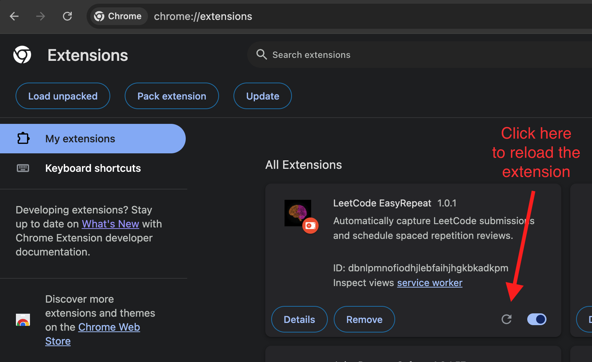
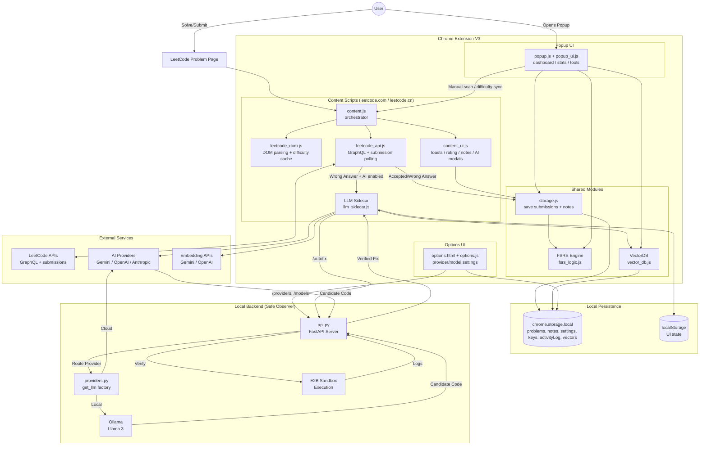

# LeetCode EasyRepeat

[English](#english) | [中文版](#中文版-chinese-version)

<a id="english"></a>

A Chrome Extension that helps you master LeetCode problems using a **Spaced Repetition System** (a learning technique that involves reviewing information at increasing intervals of time). 

It automatically tracks your submissions (both Accepted and Wrong Answer), schedules reviews based on the **FSRS v4.5 algorithm**, and features a stunning cyberpunk-inspired UI with customizable themes.


## 🚀 Quick Setup


Before loading the extension or running tests, install dependencies:

```bash
npm install
```

Build the extension bundle so `dist/` assets exist:

```bash
npm run build
```

### 📥  Install in Chrome Extensions

<div align="center">
  
</div>


1. Open Chrome and navigate to `chrome://extensions/`
2. Enable **Developer mode** (toggle in the top-right corner)
3. Click **Load unpacked**
4. Select this entire repository folder (`leetcode-srs-extension`)
5. Go to the leetcode problem page (has to be a specific problem's page!) and if you see a floating note, this setup is successful.

### 🔄 Update After Pulling New Changes

If you already installed this extension with **Load unpacked**, update it with:

```bash
git pull
npm install
npm run build
```

Then:
1. Go to `chrome://extensions/`
2. Click **Reload** on `LeetCode EasyRepeat`
3. Refresh any already-open LeetCode problem tabs

  
</div>

Notes:

- `npm install` is only needed when dependencies changed (`package.json` or `package-lock.json`).
- Running `npm run build` every time is recommended for consistency.

### 🤖 LLM Setup (Optional)
If you wish to utilize AI features, you need to set up a LLM. Here is a quick guide. Open the extension settings which is a ⚙️ shape icon, on the left bottom of our main dashboard.

<div>

  
</div>

For Local LLM:
1.  Install Ollama: <https://ollama.com/>
2.  Run `OLLAMA_ORIGINS="*" ollama serve` and
3.  `ollama pull gemma3:latest` or other model of your choice to download and run the model
4.  The extension will automatically detect the model

For Cloud LLM:
1. Enter your API key and select the model name

- Current AI features:
  - **Auto-Analyze & Save**: When you submit a wrong answer, the AI automatically analyzes your mistake and writes the actionable feedback directly into your **Contextual Notes** floating panel for future review.
- AI features in the future:
  - Generate practice problems for weak areas
  - Generate visualizations for your weaknesses
  - Nightly job run to analyze your progress and provide feedback
---

## Why would Spaced Repetition help you remember better?
- In 1932, Hermann Ebbinghaus discovered the forgetting curve, which shows that we forget information exponentially over time.
- Spaced repetition is a learning technique that involves reviewing information at increasing intervals of time. It is based on the principle that we are more likely to remember information if we review it at spaced intervals.
- Learn about [spaced repetition](https://www.khanacademy.org/science/learn-to-learn/x141050afa14cfed3:learn-to-learn/x141050afa14cfed3:spaced-repetition/a/l2l-spaced-repetition) from Khan Academy
---


## ✨ Features

### 🧠 Spaced Repetition (FSRS v4.5 Algorithm)

<div align="center">
  <video src="https://github.com/user-attachments/assets/27a799e2-3883-45c8-b616-11711fc10038" width="80%" autoplay loop muted playsinline style="border-radius: 8px; box-shadow: 0 4px 6px rgba(0,0,0,0.3);"></video>
</div>

- **Automatic Submission Detection**: Captures both "Accepted" and "Wrong Answer" submissions directly on LeetCode
- **Smart Scheduling**: Uses the state-of-the-art **FSRS v4.5** algorithm with optimized weights for superior retention modeling
- **Stability & Difficulty Modeling**: Dynamically adjusts stability and difficulty based on your performance
- **Problem Difficulty Tracking**: Automatically detects and saves LeetCode difficulty (Easy/Medium/Hard)
- FSRS was **supported by science**. You can read [this post](https://www.lesswrong.com/posts/G7fpGCi8r7nCKXsQk/the-history-of-fsrs-for-anki) to learn more about its history.


### 📝 AI Error Submission Analysis & Contextual Notes

<div align="center">
  <video src="https://github.com/user-attachments/assets/b9cf20ce-47c2-4114-ae65-04ccdaaafcc2" width="80%" autoplay loop muted playsinline style="border-radius: 8px; box-shadow: 0 4px 6px rgba(0,0,0,0.3);"></video>
</div>

- **AI Auto-Population**: If you have AI enabled, whenever you submit a wrong answer, the AI's analysis and suggested fixes will automatically be saved into these notes! (Takes a longer time if you use a local LLM)
- **Floating Notes Button**: Quickly jot down your thoughts, algorithms, or key insights for any problem without leaving the page.
- **Smart Helpers**: Helpful tooltips guide you on valid interactions (like how to drag).
- **Auto-Sync**: Notes are automatically saved to Chrome Storage and synced with the problem. So next time you open the leetcode problem page, the notes stay there.
- **Draggable Interface**: Long-press (0.4s) the "Notes" button to drag and reposition it anywhere on your screen.


### 📊 Visual Dashboard

- **Cognitive Retention Heatmap**: Global activity visualization showing your practice patterns with animated pulsing cells for active days
- **Mini Projection Timelines**: Each problem card shows projected future review dates
- **Vector Cards**: Expandable problem cards displaying:
  - Problem title and difficulty
  - Current interval and repetition count
  - Again/Hard/Good/Easy rating buttons (FSRS)
  - Direct link to the problem


### 🎨 Cyberpunk UI with Dual Themes
- **Sakura Theme** (Default): Lesbian flag-inspired color palette with neon peach, pink, and orange glows
- **Matrix Theme**: Classic green terminal aesthetic with electric cyan accents
- **Dynamic Theme Switching**: Toggle themes with one click (`Sakura`, `Matrix`, `Neural`, `Typography`); preference is saved across sessions
- **Themed Modals & Toast Notifications**: In-page success toasts and the FSRS Rating Modal seamlessly match your selected theme
- **Internationalization (i18n)**: UI available in English (`en`) and Chinese 中文 (`zh`)


<div align="center">
  
  
</div>

### ⚙️ Advanced Tools
- **Streak Repair**: Manually mark specific dates as active to fix missed activity logs


---

## 🆕 Recent Updates

### Major Changes Since v1.0.1
- **Progressive Disclosure AI UI**: Implemented a modern, step-by-step setup flow for cloud providers in the options page, featuring real-time API key validation and dynamic model discovery.
- **Unified Provider Architecture (Agnostic)**: Introduced `/providers` and `/models` endpoints with a provider-agnostic `get_llm` factory (Google, OpenAI, Anthropic, Ollama), routing all connectivity through the backend to resolve CORS issues.
- **LangChain & Pydantic Integration**: Refactored backend configuration using Pydantic Settings and migrated LLM orchestration to LangChain for more robust, observable agentic workflows.
- **Safe Observer Pass-Through**: Updated `llm_sidecar.js` to pass user-selected provider/model/key metadata to the `/autofix` endpoint, enabling per-request LLM selection.
- **Batch Verification Support**: Optimized `/verify` and `/autofix` endpoints to handle array-based test cases via JSON-stringified inputs, improving the speed and reliability of competitive programming analyses.
- **LangSmith & Observability**: Integrated tracing for backend AI operations to monitor execution paths and performance.
- **Secure Key Handling**: Migrated API key storage to a more isolated pattern consistent with modern extension security best practices.
- **Problem Title Caching**: Intelligent caching of problem localized titles (`localizedProblemTitles`) to speed up rendering without constant GraphQL fetching.
- **Popup Filtering**: Added support for filtering problems in the popup queue by difficulty, topic, and time range.
- **Smart Fail-Rating Strategy**: Failed submissions no longer blindly assign rating=1 (Again). Instead, the extension tracks a per-session fail count and caps the rating modal when the user eventually gets Accepted (0 fails → full choice, 1–2 fails → max Good, 3+ fails → max Hard). Abandoned problems (tab closed or 4-hour timeout) auto-save as Again. 
- **Internationalization**: Full i18n support with 11 languages available in the options page and a refined dictionary-style language toggle.
- **Enhanced UI & UX**:
  - Animated pulsing heatmap cells for active practice days.
  - Resolved "double scrollbar" layout issues and polished popup header/dashboard labels.
  - Relocated setup button to navigation sidebar with icon styling.
- **LLM Output Validation**: Added hallucination checkers and insight deduplication for more reliable AI-generated content (resolving previous "code sketch" ellipses issues).
- **Skill-Specific Drill Templates**: Drill generator now uses per-skill templates and language-aware code generation for targeted practice.
- **Drill Overview Page**: Dedicated overview page for browsing and managing all generated drills.
- **Build System & Tooling**: Migrated to Vite for module bundling and added comprehensive E2E tests with Puppeteer.
- **VectorDB Migration**: Moved from IndexedDB to Chrome Storage Local for better cross-context access.

---


## ⚙️ AI Configuration

The extension supports multiple AI providers for mistake analysis. Configure your preferences in the options page (click the ⚙️ Setup icon in the sidebar).


### Intelligence Source Options

#### Local Mode (Private)

- Use Ollama or LM Studio to run models locally
- Private and offline
- Lower reasoning reliability compared to cloud models
- Requires local model server running (e.g., `http://localhost:11434`)

#### Cloud Mode (Higher Quality)

- Supports multiple providers:
  - **Google Gemini** (recommended for quality)
  - **OpenAI** (GPT models)
  - **Anthropic** (Claude models)
- Requires API keys
- Higher logic and reasoning quality
- Better for accurate mistake analysis and drill generation


### Language Support

Choose from 11 languages in the options page:

- English, 中文 (Chinese), हिन्दी (Hindi), 日本語 (Japanese)
- Português (Portuguese), Deutsch (German), 한국어 (Korean)
- Français (French), Polski (Polish), Español (Spanish), Türkçe (Turkish)

Choose from 2 languages for the UI on dashboard: English and Chinese
---

## 🛠 Usage

### Automatic Tracking
Just solve problems on LeetCode! When you see "Accepted", the extension automatically saves the result and shows a themed toast notification.

### Manual Review
Click the extension icon to see:
- Problems due for review today
- All tracked problems


### SRS Rating
- **Again** → Review very soon (stability decreases significantly)
- **Hard** → Review sooner (lower stability increase)
- **Good** → Standard progression (optimal retention)
- **Easy** → Push review far into the future (higher stability)

**How ratings are assigned:**
- **Accepted on first try** → You choose any rating (Again/Hard/Good/Easy)
- **Accepted after 1–2 failed submissions** → Rating capped at Good (3)
- **Accepted after 3+ failed submissions** → Rating capped at Hard (2)
- **Abandoned** (tab closed or 4h inactivity with unresolved fails) → Auto-saved as Again (1)

Run/test results are not tracked — only Submit outcomes matter.


## 🧪 Running Tests

The project includes comprehensive unit tests covering:
- **FSRS Logic**: Stability/difficulty calculations, interval scheduling, retrievability
- **API Integration**: Mocked tests for submission polling and status verification
- **DOM Detection**: Problem extraction, difficulty parsing
- **VectorDB & RAG**: Embedding storage and similarity search
- **E2E Tests**: Puppeteer-based end-to-end browser testing (requires Chrome)

```bash
# Run all tests
npm test

# Run tests with coverage
npx jest --coverage
```

---

## 📁 Project Structure

```
leetcode-srs-extension/
├── manifest.json          # Chrome extension configuration (Manifest V3)
├── vite.config.js         # Vite build configuration
├── src/
│   ├── background.js      # Main service worker entry
│   ├── content/           # Content scripts (runs on leetcode.com / leetcode.cn)
│   │   ├── content.js     # Orchestrator
│   │   ├── content_ui.js  # Toasts, rating modal, notes widget
│   │   ├── leetcode_api.js # GraphQL + submission polling
│   │   ├── leetcode_dom.js # DOM parsing + difficulty cache
│   │   ├── llm_sidecar.js # LLM/RAG/Auto-Fix integration
│   │   ├── shadow_logger.js # Debug logging
│   │   ├── morning_greeting.js # Neural Agent greeting banner
│   │   ├── skill_graph.js # Skill DNA visualization
│   │   ├── drill_queue.js # Drill queue UI
│   │   ├── skill_animations.js # Animated UI effects
│   │   └── agent_content_init.js # Agent initialization
│   ├── popup/             # Extension popup UI
│   │   ├── popup.html
│   │   ├── popup.entry.js # Vite entry point
│   │   ├── popup.js       # Dashboard + Neural Agent tab
│   │   ├── popup_ui.js
│   │   └── popup.css
│   ├── drills/            # Micro-drill practice system
│   │   ├── drills.html    # Drill practice page
│   │   ├── drills.entry.js # Vite entry point
│   │   ├── drills.css
│   │   ├── drill_init.js  # Drill page controller
│   │   ├── drill_page.js  # Drill rendering
│   │   ├── drill_input_handler.js # Input handling for drills
│   │   ├── drill_overview.html    # Drill overview page
│   │   ├── drill_overview.entry.js # Vite entry point
│   │   ├── drill_overview.js      # Overview controller
│   │   └── drill_overview.css
│   ├── algorithms/        # SRS algorithms
│   │   ├── fsrs_logic.js  # FSRS v4.5 (primary)
│   │   ├── srs_logic.js   # SM-2 (legacy fallback)
│   │   └── vector_db.js   # Client-side VectorDB (migrated from IndexedDB to Chrome Storage)
│   ├── shared/            # Shared utilities
│   │   ├── storage.js     # Chrome storage wrapper
│   │   ├── config.js      # Configuration constants
│   │   └── dexie_db.js    # Dexie.js IndexedDB wrapper
│   ├── background/        # Neural Agent modules
│   │   ├── worker.js      # Background worker
│   │   ├── agent_loader.js # Agent initialization
│   │   ├── skill_matrix.js # Skill DNA tracking
│   │   ├── drill_generator.js # AI-powered drill creation (with skill-specific templates)
│   │   ├── drill_store.js # IndexedDB for drills
│   │   ├── drill_tracker.js # Drill progress tracking
│   │   ├── drill_types.js # Drill type definitions
│   │   ├── drill_verifier.js # Drill answer verification
│   │   ├── digest_orchestrator.js # Nightly analysis
│   │   ├── digest_scheduler.js # Digest scheduling
│   │   ├── error_pattern_detector.js # Layer 2 patterns
│   │   ├── backfill_agent.js # Tag fetcher
│   │   ├── llm_gateway.js # Multi-provider LLM abstraction
│   │   ├── gemini_client.js # Google Gemini provider
│   │   ├── openai_client.js # OpenAI provider
│   │   ├── anthropic_client.js # Anthropic Claude provider
│   │   ├── local_client.js # Ollama / LM Studio provider
│   │   ├── code_generator_agent.js # Code generation for drills
│   │   ├── hallucination_checker.js # LLM output validation
│   │   ├── insight_compressor.js # Insight data compression
│   │   ├── insight_deduplicator.js # Duplicate insight detection
│   │   ├── insights_store.js # Insights persistence
│   │   ├── day_log_harvester.js # Daily activity harvesting
│   │   ├── retention_policy.js # Data retention management
│   │   ├── sandbox_client.js # E2B sandbox integration
│   │   └── async_notifier.js # Async notification helper
│   ├── options/           # Settings page
│   │   ├── options.html
│   │   ├── options.entry.js # Vite entry point
│   │   ├── options.js     # Settings logic (includes inline i18n for 11 languages)
│   │   └── options.css
│   └── data/              # Static data
│       └── skill_taxonomy.json
├── scripts/               # Dev/debug utilities
│   ├── benchmark_drills.js
│   ├── debug_extension.js
│   └── manual_test_extension.sh
├── mcp-server/            # Local Auto-Fix server (Python)
├── tests/                 # Jest tests (60+ files)
└── assets/                # Icons and images
```

---

## 🔧 Technical Challenges & Robustness

Building a reliable agentic extension on top of non-deterministic LLMs presented unique engineering challenges. This project implements several architectural patterns to ensure stability.

### 1. Handling LLM Hallucinations (Fault Isolation)
LLMs occasionally fail to follow strict output schemas (like JSON), even with careful prompting. A naive implementation would crash if the model returned malformed data for a single request.

**Our Solution: Component-Level Fault Tolerance**
The system treats every AI operation as an isolated transaction. In the `Drill Generator` workflow:
- The system iterates through multiple user "weak skills" (e.g., *Dynamic Programming*, *Graphs*).
- Each skill generation is wrapped in a "Safe Guard" pattern.
- **Real-World Example:** If the model acts up while generating *Graph* drills (returning invalid JSON), the system catches the error, logs a warning, and **seamlessly proceeds** to generate drills for *Dynamic Programming*.
- This ensures the user always gets *some* value, rather than a broken loading spinner.

### 2. The "JSON-In-Markdown" Problem
LLMs trained for chat often wrap code in markdown backticks (```json ... ```), which breaks standard `JSON.parse()`.

**Our Solution: Heuristic Extraction Strategy**
We implemented a multi-pass parser in the `LLMGateway`:

1.  **Strict Mode:** Enforce `response_mime_type: "application/json"` in the API request (for models that support it).
2.  **Pattern Matching:** Regex extraction of content within markdown code blocks.
3.  **Boundary Search:** Fallback logic that locates the outermost `{` and `}` to extract valid JSON objects from mixed-text responses.

### 3. Graceful Degradation (The Fallback Ladder)

The system is designed never to leave the user empty-handed.

1.  **Tier 1 (Best):** Personalized drills generated live by AI based on recent mistakes.
2.  **Tier 2 (Fallback):** If the API is unreachable (or offline), use "Skill DNA" patterns stored locally to select pre-written templates.
3.  **Tier 3 (Safety):** If no history exists, provide curated "Demo" drills to showcase functionality.

This ladder ensures the extension is functional immediately upon installation, even before the user configures their API keys.

### 4. Multi-Provider LLM Gateway

The extension uses a unified `LLMGateway` abstraction that supports multiple AI providers:

- **Cloud Providers**: Google Gemini, OpenAI, Anthropic Claude
- **Local Providers**: Ollama, LM Studio (OpenAI-compatible endpoints)
- **Automatic Fallback**: If one provider fails, the system can gracefully degrade
- **Provider-Specific Optimizations**: Each provider has tailored request formatting and response parsing

---

## 🔧 Technical Details

### FSRS v4.5 Algorithm
The extension implements the **Free Spaced Repetition Scheduler (FSRS) v4.5**, a modern algorithm that outperforms SM-2:
- **Stability-based Scheduling**: Uses a forgetting curve model with optimized weights trained on large datasets
- **Difficulty Modeling**: Tracks per-problem difficulty (1-10) with automatic adjustment
- **Retrievability Calculation**: Predicts your probability of recall at any given time
- **Formula**: `Interval = Stability / FACTOR * (R^(1/DECAY) - 1)` where R=0.9 (target retention)

### Architecture




### AI Analysis Workflow Strategy

The following sequence diagram details the decision-making process for analyzing user mistakes, optimizing for speed and cost by prioritizing cached solutions (RAG) before attempting expensive verification (Auto-Fix).

```mermaid
sequenceDiagram
    participant User
    participant Sidecar as LLM Sidecar<br/>(llm_sidecar.js)
    participant RAG as VectorDB<br/>(vector_db.js)
    participant API as MCP Server<br/>(api.py)
    participant Sandbox as E2B Sandbox<br/>(server.py)
    participant LLM as AI Model<br/>(Cloud/Local)

    User->>Sidecar: 1. Submits Wrong Answer
    Note over Sidecar: llm_sidecar.js:385

    rect rgb(20, 20, 30)
        note right of Sidecar: Phase 1: Knowledge Retrieval
        Sidecar->>RAG: 2. Search Similar Mistakes
        RAG-->>Sidecar: Return Matches (Score 0-1)
        Note over Sidecar: llm_sidecar.js:400
    end

    alt High Confidence Match (> 92%)
        Sidecar->>User: 3a. Return Cached Advice IMMEDIATE
        Note over Sidecar, User: Skip Auto-Fix & LLM Call
    else Low Confidence
        rect rgb(40, 20, 20)
            note right of Sidecar: Phase 2: Safe Observer (Auto-Fix)
            Sidecar->>API: 3b. Request Auto-Fix (/autofix)
            Note over Sidecar: llm_sidecar.js:450
            API->>LLM: Generate Candidate Fix
            LLM-->>API: Python Code
            API->>Sandbox: Verify Fix (server.py)
            Sandbox-->>API: Execution Logs
            API-->>Sidecar: Verified Code + Logs
        end

        rect rgb(20, 20, 40)
            note right of Sidecar: Phase 3: Final Analysis
            Sidecar->>LLM: 4. Analyze with Context (RAG + Verification)
            LLM-->>Sidecar: Final Explanation JSON
            Sidecar->>User: 5. Display Analysis
        end
    end
```



### Storage
Uses Chrome's `chrome.storage.local` API to persist:
- Problem data (title, slug, difficulty, stability, difficulty score, state)
- Theme preference
- Activity log for streak tracking
- Vector embeddings for RAG
- Backup metadata for manual export/restore from the options page

---

## 📝 License

MIT License - feel free to modify and distribute!


## 🧠 Further thoughts around Studying LeetCode
- My own strategy was to get at least 3-5 problems done in a topic, gain my brain "muscle memory" before moving on to the next topic. After finishing all topics, that's when I try to solve a problem without knowing which algorithm or topic it falls into. Do you also find this useful?
- I recommend a free class, **Learning how to learn** from Coursera which help explains why doing leetcode problems by topics at first is a good strategy.
- Leave an "issue" on this repo if you want to discuss this topic further! Or anything related to the science of learning

---

<br><br><br>

<a id="中文版-chinese-version"></a>

# LeetCode EasyRepeat (中文版)

一个帮助你使用**间隔重复系统**(Spaced Repetition System，一种通过逐渐增加时间间隔复习来巩固记忆的学习技巧) 来掌握 LeetCode 题目的 Chrome 扩展程序。

它能自动追踪你在 LeetCode 上 "Accepted" (通过) 的提交记录，基于目前最前沿的 **FSRS v4.5** 算法为你安排科学的复习周期，并且包含一套非常炫酷的赛博朋克风 UI 和可定制主题。

## 🚀 快速安装启动

安装扩展或运行测试前，请先安装依赖：

```bash
npm install
```

构建打包文件，生成 `dist/` 目录：

```bash
npm run build
```

### 📥 在 Chrome 扩展中加载

<div align="center">
  
</div>

1. 打开 Chrome 浏览器并前往 `chrome://extensions/`
2. 打开右上角的 **开发者模式 (Developer mode)**
3. 点击 **加载已解压的扩展程序 (Load unpacked)**
4. 选择本仓库的整个文件夹 (`leetcode-srs-extension`)
5. 随便打开一道 LeetCode 的题目详情页（必须是在具体的做题页面内！），如果看到了一个悬浮的记笔记按钮 (floating note)，那就说明你已经安装成功啦！

### 🔄 拉取新版本后如何更新

如果你已经通过 **Load unpacked** 安装过扩展，后续更新可以按下面做：

```bash
git pull
npm install
npm run build
```

然后：
1. 打开 `chrome://extensions/`
2. 在 `LeetCode EasyRepeat` 上点击 **重新加载 (Reload)**
3. 把已经打开的 LeetCode 题目页面也刷新一下

<div align="center">
  
</div>

说明：
- `npm install` 只有在依赖变化时才需要（`package.json` 或 `package-lock.json` 有改动）。
- 为了稳妥，建议每次更新都执行一次 `npm run build`。

### 🤖 LLM (大语言模型) 配置 (可选)
如果你想使用 AI 功能，你需要配置一个大语言模型 (LLM)。这里是极简配置指南。点击主面板左下角 ⚙️ 形状的设置图标进入扩展设置。

<div >
  
</div>

**使用本地 LLM (完全免费、保护隐私):**
1. 安装 Ollama: https://ollama.com/
2. 在终端运行 `OLLAMA_ORIGINS="*" ollama serve` 以及 `ollama pull gemma3:latest` (或者下载你选择的其他模型) 让模型运行起来。
3. 扩展程序会自动检测到本地模型。

**使用云端 LLM (质量更高):**
1. 输入你的 API Key 并选择对应的模型名称即可。

- **目前的 AI 功能:**
  - **自动分析与保存**: 当你提交了错误的代码时，AI 会自动分析你的错误，并将具有操作性的反馈建议直接写进你页面的 **悬浮笔记 (Contextual Notes)** 中，方便之后复习。
- **未来计划的 AI 功能:**
  - 针对你的薄弱环节生成专属练习题。
  - 为你的能力缺陷生成各种可视化图表分析。
  - 每日夜间定时任务：分析你一天的进度并提供总结反馈。

---

## 为什么间隔重复系统 (Spaced Repetition) 能帮你记牢？
- 在 1932 年，Hermann Ebbinghaus 发现了遗忘曲线，表明人类遗忘信息的速度呈指数级下落。
- “间隔重复”是一种学习技巧，核心理念是在不断增加的时间间隔里复习同一份信息。由于在即将遗忘的边缘进行回忆，你的大脑会把这段记忆刻得更深。
- 可以在可汗学院了解关于 [间隔重复的科学知识](https://www.khanacademy.org/science/learn-to-learn/x141050afa14cfed3:learn-to-learn/x141050afa14cfed3:spaced-repetition/a/l2l-spaced-repetition)。

---

## ✨ 核心功能

### 🧠 间隔重复调度 (基于 FSRS v4.5 算法)

<div align="center">
  <video src="https://github.com/user-attachments/assets/27a799e2-3883-45c8-b616-11711fc10038" width="80%" autoplay loop muted playsinline style="border-radius: 8px; box-shadow: 0 4px 6px rgba(0,0,0,0.3);"></video>
</div>

- **自动检测提交**: 直接在 LeetCode 页面上捕获你的提交结果，无论是通过 ("Accepted") 还是错误 ("Wrong Answer") 都会被记录到复习系统中。
- **智能调度安排**: 采用顶尖的 **FSRS v4.5** 算法和优化的权重，为你量身定制题目复习计划。
- **稳定性与难度建模**: 根据你在每道题上的表现反馈（忘记、困难、良好、简单），动态调整该题目的记忆稳定性和难度。
- **题目难度检测**: 自动抓取并记录这道题在 LeetCode 上的官方难度阶级 (Easy / Medium / Hard)。
- 注：FSRS 的高效性是由认知科学数据严格支撑的。你可以通过 [这篇文章](https://www.lesswrong.com/posts/G7fpGCi8r7nCKXsQk/the-history-of-fsrs-for-anki) 了解它背后的研究历史。

### 📝 AI 错题分析 & 悬浮笔记面板 (Contextual Notes)

<div align="center">
  <video src="https://github.com/user-attachments/assets/b9cf20ce-47c2-4114-ae65-04ccdaaafcc2" width="80%" autoplay loop muted playsinline style="border-radius: 8px; box-shadow: 0 4px 6px rgba(0,0,0,0.3);"></video>
</div>

- **AI 自动总结填入**: 如果启用了 AI 功能，每次代码 Submit 失败后，AI 会立刻分析报错并指出修补建议，并**自动将其写入该题的专属笔记中**！（如果使用本地模型可能需要稍等片刻）。
- **悬浮笔记按钮**: 在你刷题时不离开当前页面，就能随手记下思路、算法要点和感悟。
- **智能手势提示**: 通过小工具提示教你如何操作面板。
- **云端与存储自动同步**: 你的笔记会自动保存在 Chrome 本地存储中。下次你再打开这道题，笔记就会安安静静地在那里等你。
- **可随意拖拽**: 长按 (0.4秒) 笔记按钮，可以将它拖拽放置到屏幕任何地方，防止遮挡你的代码。

### 📊 面板数据可视化 (Visual Dashboard)

- **认知留存热力图**: 类似 GitHub 的活跃度绿格子，记录你的刷题周期，处于活跃天数的格子会有非常赛博朋克的呼吸灯/脉冲动画！
- **复习时间预测线**: 每张题目卡片都会画出预测的下几次复习的具体日期。
- **题目卡片 (Vector Cards)**: 可展开的折叠卡片，清晰展示：
  - 题目名称、链接和官方难度。
  - 当前记忆间隔和已经复习的次数。
  - Again(重来) / Hard(困难) / Good(良好) / Easy(简单) 评价按钮。

**评分机制：**
- **一次提交就通过** → 自由选择任意评分 (Again/Hard/Good/Easy)
- **失败 1–2 次后通过** → 最高只能选 Good (3)
- **失败 3 次以上后通过** → 最高只能选 Hard (2)
- **放弃了**（关闭标签页或 4 小时无活动且有失败记录）→ 自动记为 Again (1)

Run/测试的结果不会被追踪，只有 Submit 的结果才会被记录。

### 🎨 赛博朋克风 UI (双主题系统)
- **樱花主题 (Sakura / 默认)**: 灵感来自 Lesbian 旗帜配色，粉色、紫红与橙色的霓虹发光质感。
- **矩阵主题 (Matrix)**: 经典的黑绿终端极客黑客风，带有亮青色点缀。
- 随时通过侧边栏一键切换主题，你的选择会被永久保存。

<div align="center">
  
  
</div>

---

## ⚙️ 大语言模型 (AI) 配置清单与语种

我们的扩展完美适配多种语言及多个平台的底层大模型，请在设置项进行修改。

- **包含在本地化 (i18n) 里的语言选择项 (11种):**
  英语，中文，印地语，日语，葡萄牙语，德语，韩语，法语，波兰语，西班牙语，土耳其语

- **支持的本地运行模式 (零成本、绝对隐私):**
  直接跑在你本机的 Ollama, LM Studio 等模型。不需要网络请求，安全隐私拉满（由于本机算力限制，逻辑推理能力相比云端大厂模型偏弱）。

- **支持接入云端平台 (更聪颖强大的逻辑):**
  完美支持 **Google Gemini** (最推荐的智力水平与性价比), **OpenAI (ChatGPT)** 以及 **Anthropic Claude**。输入 API 密钥即可启用，适合希望进行深度分析报错的用户。

---

## 🧠 关于刷题的进一步思考与经验分享
- 我个人的刷题闭环策略是：**在同一个知识标签/话题下，至少连着做 3 到 5 道题**，让大脑强行产生这方面的“肌肉记忆”后，再切换到下一个类型。当所有的常规分类主题你都摸了一遍后，最后再进入“混做模式”（即打开题目前你并不知道这题考验到底是什么算法）。你觉得这个做法对你有用吗？
- 我在此安利 Coursera 上非常经典的一门免费课程：**[Learning how to learn (学习如何学习)]**。这门课在科学上非常细致地解释了为什么“按题目类型集中轰炸”会产生更好的初始学习策略和建立记忆神经元。
- 如果你对大脑的科学记忆、或是 LeetCode 刷题闭环有任何新的想法或探讨，欢迎直接在这个项目下提 Issue，咱们互相交流！

---
