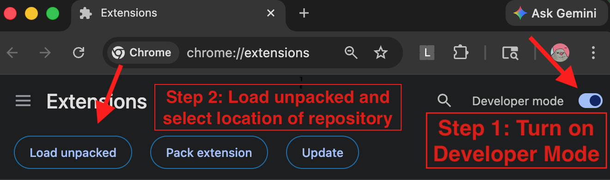
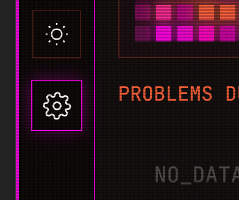
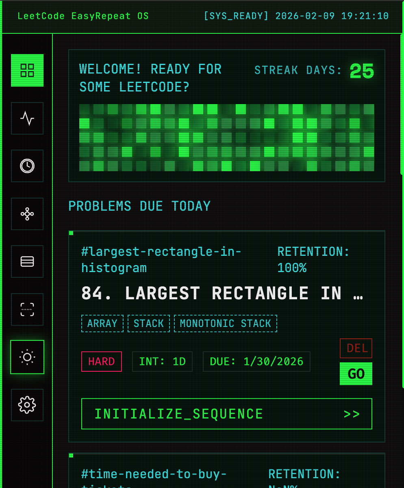
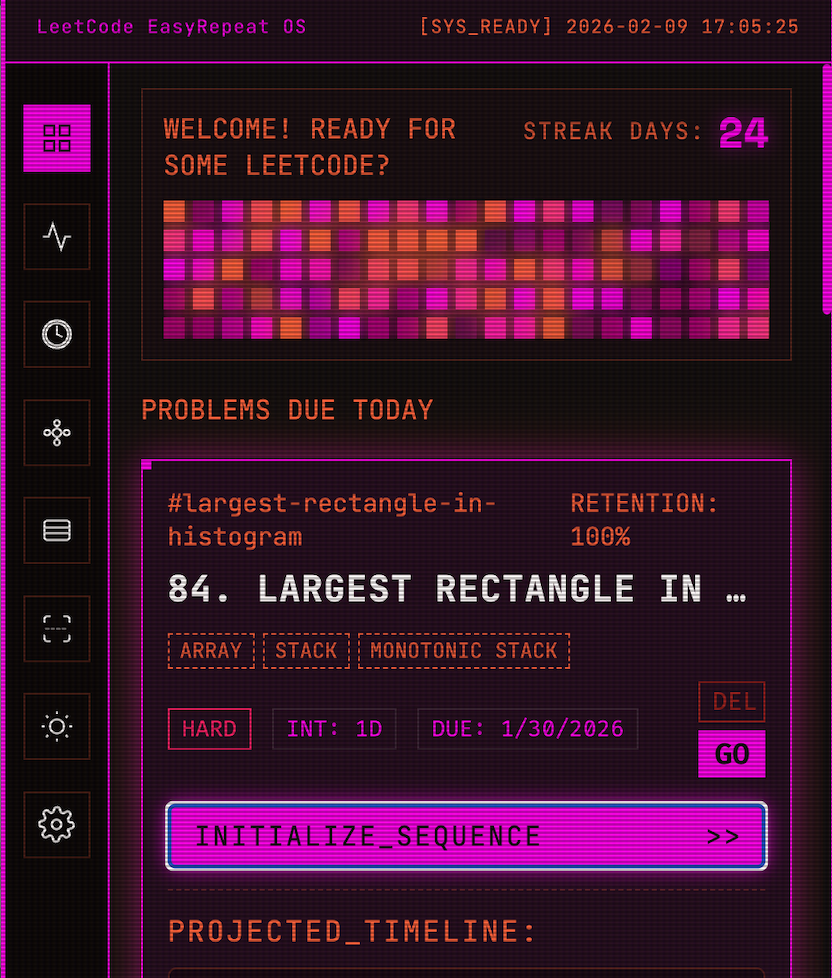
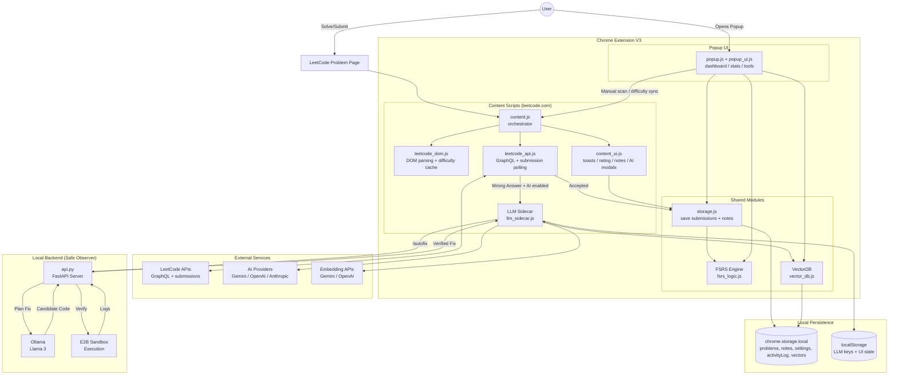

# LeetCode EasyRepeat

A Chrome Extension that helps you master LeetCode problems using a **Spaced Repetition System**( a learning technique that involves reviewing information at increasing intervals of time). 

It automatically tracks your "Accepted" submissions, schedules reviews based on the **FSRS v4.5 algorithm**, and features a stunning cyberpunk-inspired UI with customizable themes.


## 🚀 Quick Setup

Before loading the extension or running tests, install dependencies:

```bash
npm install
```

Build the extension bundle so `dist/` assets exist:

```bash
npm run build
```

### 📥  Install in Chrome Extensions

<div align="center">
  
</div>


1. Open Chrome and navigate to `chrome://extensions/`
2. Enable **Developer mode** (toggle in the top-right corner)
3. Click **Load unpacked**
4. Select this entire repository folder (`leetcode-srs-extension`)

### 🤖 LLM Setup (Optional)
If you wish to utilize AI features, you need to set up a LLM. Here is a quick guide. Open the extension settings which is a ⚙️ shape icon, on the left bottom of our main dashboard.

<div >
  
</div>

For Local LLM:
1. Install Ollama: https://ollama.com/
2. Run `OLLAMA_ORIGINS="*" ollama serve` and
`ollama pull gemma3:latestt` or other model of your choice to download and run the model
1. The extension will automatically detect the model

For Cloud LLM:
1. Enter your API key and select the model name

- Current AI features:
  - **Auto-Analyze & Save**: When you submit a wrong answer, the AI automatically analyzes your mistake and writes the actionable feedback directly into your **Contextual Notes** floating panel for future review.
- AI features in the future:
  - Generate practice problems for weak areas
  - Generate visualizations for your weaknesses
  - Nightly job run to analyze your progress and provide feedback
---

## Why would Spaced Repetition help you remember better?
- In 1932, Hermann Ebbinghaus discovered the forgetting curve, which shows that we forget information exponentially over time.
- Spaced repetition is a learning technique that involves reviewing information at increasing intervals of time. It is based on the principle that we are more likely to remember information if we review it at spaced intervals.
- Learn about [spaced repetition](https://www.khanacademy.org/science/learn-to-learn/x141050afa14cfed3:learn-to-learn/x141050afa14cfed3:spaced-repetition/a/l2l-spaced-repetition) from Khan Academy
---


## ✨ Features

### 🧠 Spaced Repetition (FSRS v4.5 Algorithm)

<div align="center">
  <video src="https://github.com/user-attachments/assets/27a799e2-3883-45c8-b616-11711fc10038" width="80%" autoplay loop muted playsinline style="border-radius: 8px; box-shadow: 0 4px 6px rgba(0,0,0,0.3);"></video>
</div>

- **Automatic Submission Detection**: Captures "Accepted" submissions directly on LeetCode
- **Smart Scheduling**: Uses the state-of-the-art **FSRS v4.5** algorithm with optimized weights for superior retention modeling
- **Stability & Difficulty Modeling**: Dynamically adjusts stability and difficulty based on your performance
- **Problem Difficulty Tracking**: Automatically detects and saves LeetCode difficulty (Easy/Medium/Hard)
- FSRS was **supported by science**. You can read [this post](https://www.lesswrong.com/posts/G7fpGCi8r7nCKXsQk/the-history-of-fsrs-for-anki) to learn more about its history.


### 📝 AI Error Submission Analysis & Contextual Notes

<div align="center">
  <video src="https://github.com/user-attachments/assets/b9cf20ce-47c2-4114-ae65-04ccdaaafcc2" width="80%" autoplay loop muted playsinline style="border-radius: 8px; box-shadow: 0 4px 6px rgba(0,0,0,0.3);"></video>
</div>

- **AI Auto-Population**: If you have AI enabled, whenever you submit a wrong answer, the AI's analysis and suggested fixes will automatically be saved into these notes! (Takes a longer time if you use a local LLM)
- **Floating Notes Button**: Quickly jot down your thoughts, algorithms, or key insights for any problem without leaving the page.
- **Smart Helpers**: Helpful tooltips guide you on valid interactions (like how to drag).
- **Auto-Sync**: Notes are automatically saved to Chrome Storage and synced with the problem. So next time you open the leetcode problem page, the notes stay there.
- **Draggable Interface**: Long-press (0.4s) the "Notes" button to drag and reposition it anywhere on your screen.


### 📊 Visual Dashboard

- **Cognitive Retention Heatmap**: Global activity visualization showing your practice patterns with animated pulsing cells for active days
- **Mini Projection Timelines**: Each problem card shows projected future review dates
- **Vector Cards**: Expandable problem cards displaying:
  - Problem title and difficulty
  - Current interval and repetition count
  - Again/Hard/Good/Easy rating buttons (FSRS)
  - Direct link to the problem


### 🎨 Cyberpunk UI with Dual Themes
- **Sakura Theme** (Default): Lesbian flag-inspired color palette with neon peach, pink, and orange glows
- **Matrix Theme**: Classic green terminal aesthetic with electric cyan accents
- **Dynamic Theme Switching**: Toggle themes with one click; preference is saved across sessions
- **Themed Toast Notifications**: In-page success toasts match your selected theme

<div align="center">
  
  
</div>

### ⚙️ Advanced Tools
- **Streak Repair**: Manually mark specific dates as active to fix missed activity logs


---

## 🆕 Recent Updates

### Major Changes Since v1.0.0

- **Multi-Provider AI Support**: Added support for Google Gemini, OpenAI, Anthropic Claude, and local models (Ollama, LM Studio) through a unified LLMGateway
- **Internationalization**: Full i18n support with 11 languages available in the options page
- **Enhanced UI**:
  - Animated pulsing heatmap cells for active practice days
  - Relocated setup button to navigation sidebar with icon styling
  - Refined popup header and dashboard labels
- **Skill-Specific Drill Templates**: Drill generator now uses per-skill templates and language-aware code generation for more targeted practice(not live to external audience yet)
- **Drill Overview Page**: Dedicated overview page for browsing and managing all generated drills(not live to external audience yet)
- **Provider-Specific LLM Clients**: Individual client modules for Gemini, OpenAI, Anthropic, and local models with provider-specific optimizations
- **LLM Output Validation**: Hallucination checker and insight deduplication for more reliable AI-generated content
- **Improved Tools**:
  - Removed test/simulation mode (deprecated)
  - Added dedicated streak repair tool in options page
  - Enhanced drill generation with detailed status reporting and queue state visibility
- **Build System**: Migrated to Vite for module bundling with per-page entry points and consolidated background scripts
- **VectorDB Migration**: Moved from IndexedDB to Chrome Storage Local for better cross-context access
- **Browser Testing**: Added comprehensive E2E tests with Puppeteer

---


## ⚙️ AI Configuration

The extension supports multiple AI providers for mistake analysis. Configure your preferences in the options page (click the ⚙️ Setup icon in the sidebar).


### Intelligence Source Options

#### Local Mode (Private)

- Use Ollama or LM Studio to run models locally
- Private and offline
- Lower reasoning reliability compared to cloud models
- Requires local model server running (e.g., `http://localhost:11434`)

#### Cloud Mode (Higher Quality)

- Supports multiple providers:
  - **Google Gemini** (recommended for quality)
  - **OpenAI** (GPT models)
  - **Anthropic** (Claude models)
- Requires API keys
- Higher logic and reasoning quality
- Better for accurate mistake analysis and drill generation


### Language Support

Choose from 11 languages in the options page:

- English, 中文 (Chinese), हिन्दी (Hindi), 日本語 (Japanese)
- Português (Portuguese), Deutsch (German), 한국어 (Korean)
- Français (French), Polski (Polish), Español (Spanish), Türkçe (Turkish)

---

## 🛠 Usage

### Automatic Tracking
Just solve problems on LeetCode! When you see "Accepted", the extension automatically saves the result and shows a themed toast notification.

### Manual Review
Click the extension icon to see:
- Problems due for review today
- All tracked problems


### SRS Rating
- **Again** → Review very soon (stability decreases significantly)
- **Hard** → Review sooner (lower stability increase)
- **Good** → Standard progression (optimal retention)
- **Easy** → Push review far into the future (higher stability)


## 🧪 Running Tests

The project includes comprehensive unit tests covering:
- **FSRS Logic**: Stability/difficulty calculations, interval scheduling, retrievability
- **API Integration**: Mocked tests for submission polling and status verification
- **DOM Detection**: Problem extraction, difficulty parsing
- **VectorDB & RAG**: Embedding storage and similarity search
- **E2E Tests**: Puppeteer-based end-to-end browser testing (requires Chrome)

```bash
# Run all tests
npm test

# Run tests with coverage
npx jest --coverage
```

---

## 📁 Project Structure

```
leetcode-srs-extension/
├── manifest.json          # Chrome extension configuration (Manifest V3)
├── vite.config.js         # Vite build configuration
├── src/
│   ├── background.js      # Main service worker entry
│   ├── content/           # Content scripts (runs on leetcode.com)
│   │   ├── content.js     # Orchestrator
│   │   ├── content_ui.js  # Toasts, rating modal, notes widget
│   │   ├── leetcode_api.js # GraphQL + submission polling
│   │   ├── leetcode_dom.js # DOM parsing + difficulty cache
│   │   ├── llm_sidecar.js # LLM/RAG/Auto-Fix integration
│   │   ├── shadow_logger.js # Debug logging
│   │   ├── morning_greeting.js # Neural Agent greeting banner
│   │   ├── skill_graph.js # Skill DNA visualization
│   │   ├── drill_queue.js # Drill queue UI
│   │   ├── skill_animations.js # Animated UI effects
│   │   └── agent_content_init.js # Agent initialization
│   ├── popup/             # Extension popup UI
│   │   ├── popup.html
│   │   ├── popup.entry.js # Vite entry point
│   │   ├── popup.js       # Dashboard + Neural Agent tab
│   │   ├── popup_ui.js
│   │   └── popup.css
│   ├── drills/            # Micro-drill practice system
│   │   ├── drills.html    # Drill practice page
│   │   ├── drills.entry.js # Vite entry point
│   │   ├── drills.css
│   │   ├── drill_init.js  # Drill page controller
│   │   ├── drill_page.js  # Drill rendering
│   │   ├── drill_input_handler.js # Input handling for drills
│   │   ├── drill_overview.html    # Drill overview page
│   │   ├── drill_overview.entry.js # Vite entry point
│   │   ├── drill_overview.js      # Overview controller
│   │   └── drill_overview.css
│   ├── algorithms/        # SRS algorithms
│   │   ├── fsrs_logic.js  # FSRS v4.5 (primary)
│   │   ├── srs_logic.js   # SM-2 (legacy fallback)
│   │   └── vector_db.js   # Client-side VectorDB (migrated from IndexedDB to Chrome Storage)
│   ├── shared/            # Shared utilities
│   │   ├── storage.js     # Chrome storage wrapper
│   │   ├── config.js      # Configuration constants
│   │   └── dexie_db.js    # Dexie.js IndexedDB wrapper
│   ├── background/        # Neural Agent modules
│   │   ├── worker.js      # Background worker
│   │   ├── agent_loader.js # Agent initialization
│   │   ├── skill_matrix.js # Skill DNA tracking
│   │   ├── drill_generator.js # AI-powered drill creation (with skill-specific templates)
│   │   ├── drill_store.js # IndexedDB for drills
│   │   ├── drill_tracker.js # Drill progress tracking
│   │   ├── drill_types.js # Drill type definitions
│   │   ├── drill_verifier.js # Drill answer verification
│   │   ├── digest_orchestrator.js # Nightly analysis
│   │   ├── digest_scheduler.js # Digest scheduling
│   │   ├── error_pattern_detector.js # Layer 2 patterns
│   │   ├── backfill_agent.js # Tag fetcher
│   │   ├── llm_gateway.js # Multi-provider LLM abstraction
│   │   ├── gemini_client.js # Google Gemini provider
│   │   ├── openai_client.js # OpenAI provider
│   │   ├── anthropic_client.js # Anthropic Claude provider
│   │   ├── local_client.js # Ollama / LM Studio provider
│   │   ├── code_generator_agent.js # Code generation for drills
│   │   ├── hallucination_checker.js # LLM output validation
│   │   ├── insight_compressor.js # Insight data compression
│   │   ├── insight_deduplicator.js # Duplicate insight detection
│   │   ├── insights_store.js # Insights persistence
│   │   ├── day_log_harvester.js # Daily activity harvesting
│   │   ├── retention_policy.js # Data retention management
│   │   ├── sandbox_client.js # E2B sandbox integration
│   │   └── async_notifier.js # Async notification helper
│   ├── options/           # Settings page
│   │   ├── options.html
│   │   ├── options.entry.js # Vite entry point
│   │   ├── options.js     # Settings logic (includes inline i18n for 11 languages)
│   │   └── options.css
│   └── data/              # Static data
│       └── skill_taxonomy.json
├── scripts/               # Dev/debug utilities
│   ├── benchmark_drills.js
│   ├── debug_extension.js
│   └── manual_test_extension.sh
├── mcp-server/            # Local Auto-Fix server (Python)
├── tests/                 # Jest tests (60+ files)
└── assets/                # Icons and images
```

---

## 🔧 Technical Challenges & Robustness

Building a reliable agentic extension on top of non-deterministic LLMs presented unique engineering challenges. This project implements several architectural patterns to ensure stability.

### 1. Handling LLM Hallucinations (Fault Isolation)
LLMs occasionally fail to follow strict output schemas (like JSON), even with careful prompting. A naive implementation would crash if the model returned malformed data for a single request.

**Our Solution: Component-Level Fault Tolerance**
The system treats every AI operation as an isolated transaction. In the `Drill Generator` workflow:
- The system iterates through multiple user "weak skills" (e.g., *Dynamic Programming*, *Graphs*).
- Each skill generation is wrapped in a "Safe Guard" pattern.
- **Real-World Example:** If the model acts up while generating *Graph* drills (returning invalid JSON), the system catches the error, logs a warning, and **seamlessly proceeds** to generate drills for *Dynamic Programming*.
- This ensures the user always gets *some* value, rather than a broken loading spinner.

### 2. The "JSON-In-Markdown" Problem
LLMs trained for chat often wrap code in markdown backticks (```json ... ```), which breaks standard `JSON.parse()`.

**Our Solution: Heuristic Extraction Strategy**
We implemented a multi-pass parser in the `LLMGateway`:

1.  **Strict Mode:** Enforce `response_mime_type: "application/json"` in the API request (for models that support it).
2.  **Pattern Matching:** Regex extraction of content within markdown code blocks.
3.  **Boundary Search:** Fallback logic that locates the outermost `{` and `}` to extract valid JSON objects from mixed-text responses.

### 3. Graceful Degradation (The Fallback Ladder)

The system is designed never to leave the user empty-handed.

1.  **Tier 1 (Best):** Personalized drills generated live by AI based on recent mistakes.
2.  **Tier 2 (Fallback):** If the API is unreachable (or offline), use "Skill DNA" patterns stored locally to select pre-written templates.
3.  **Tier 3 (Safety):** If no history exists, provide curated "Demo" drills to showcase functionality.

This ladder ensures the extension is functional immediately upon installation, even before the user configures their API keys.

### 4. Multi-Provider LLM Gateway

The extension uses a unified `LLMGateway` abstraction that supports multiple AI providers:

- **Cloud Providers**: Google Gemini, OpenAI, Anthropic Claude
- **Local Providers**: Ollama, LM Studio (OpenAI-compatible endpoints)
- **Automatic Fallback**: If one provider fails, the system can gracefully degrade
- **Provider-Specific Optimizations**: Each provider has tailored request formatting and response parsing

---

## 🔧 Technical Details

### FSRS v4.5 Algorithm
The extension implements the **Free Spaced Repetition Scheduler (FSRS) v4.5**, a modern algorithm that outperforms SM-2:
- **Stability-based Scheduling**: Uses a forgetting curve model with optimized weights trained on large datasets
- **Difficulty Modeling**: Tracks per-problem difficulty (1-10) with automatic adjustment
- **Retrievability Calculation**: Predicts your probability of recall at any given time
- **Formula**: `Interval = Stability / FACTOR * (R^(1/DECAY) - 1)` where R=0.9 (target retention)

### Architecture




### AI Analysis Workflow Strategy

The following sequence diagram details the decision-making process for analyzing user mistakes, optimizing for speed and cost by prioritizing cached solutions (RAG) before attempting expensive verification (Auto-Fix).

```mermaid
sequenceDiagram
    participant User
    participant Sidecar as LLM Sidecar<br/>(llm_sidecar.js)
    participant RAG as VectorDB<br/>(vector_db.js)
    participant API as MCP Server<br/>(api.py)
    participant Sandbox as E2B Sandbox<br/>(server.py)
    participant LLM as AI Model<br/>(Cloud/Local)

    User->>Sidecar: 1. Submits Wrong Answer
    Note over Sidecar: llm_sidecar.js:385

    rect rgb(20, 20, 30)
        note right of Sidecar: Phase 1: Knowledge Retrieval
        Sidecar->>RAG: 2. Search Similar Mistakes
        RAG-->>Sidecar: Return Matches (Score 0-1)
        Note over Sidecar: llm_sidecar.js:400
    end

    alt High Confidence Match (> 92%)
        Sidecar->>User: 3a. Return Cached Advice IMMEDIATE
        Note over Sidecar, User: Skip Auto-Fix & LLM Call
    else Low Confidence
        rect rgb(40, 20, 20)
            note right of Sidecar: Phase 2: Safe Observer (Auto-Fix)
            Sidecar->>API: 3b. Request Auto-Fix (/autofix)
            Note over Sidecar: llm_sidecar.js:450
            API->>LLM: Generate Candidate Fix
            LLM-->>API: Python Code
            API->>Sandbox: Verify Fix (server.py)
            Sandbox-->>API: Execution Logs
            API-->>Sidecar: Verified Code + Logs
        end

        rect rgb(20, 20, 40)
            note right of Sidecar: Phase 3: Final Analysis
            Sidecar->>LLM: 4. Analyze with Context (RAG + Verification)
            LLM-->>Sidecar: Final Explanation JSON
            Sidecar->>User: 5. Display Analysis
        end
    end
```



### Storage
Uses Chrome's `chrome.storage.local` API to persist:
- Problem data (title, slug, difficulty, stability, difficulty score, state)
- Theme preference
- Activity log for streak tracking
- Vector embeddings for RAG

---

## 📝 License

MIT License - feel free to modify and distribute!


## 🧠 Resources & Talks around Studying LeetCode
- My own strategy was to get at least 3-5 problems done in a topic, gain my brain "muscle memory" before moving on to the next topic. After finishing all topics, that's when I try to solve a problem without knowing which algorithm or topic it falls into. Do you also find this useful?
- I recommend a free class, **Learning how to learn** from Coursera which help explains why doing leetcode problems by topics at first is a good strategy.
- Leave an "issue" on this repo if you want to discuss this topic further! Or anything related to the science of learning